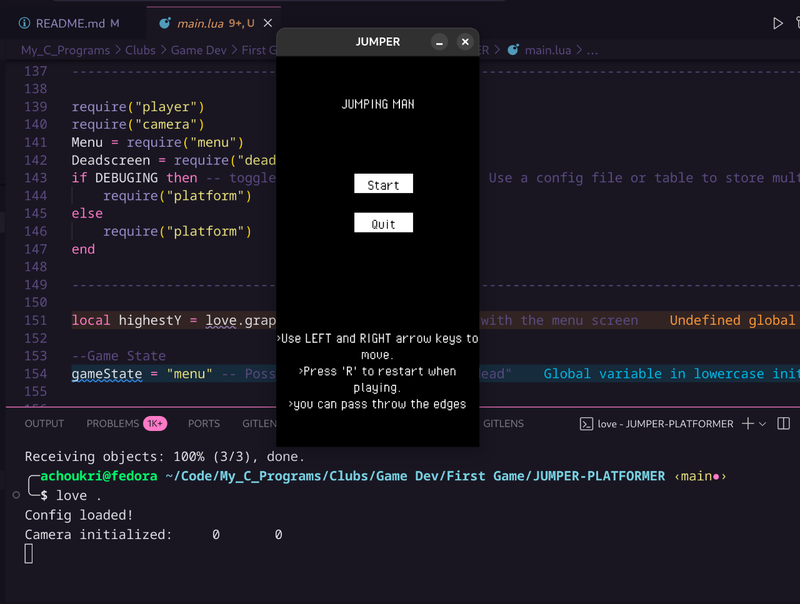
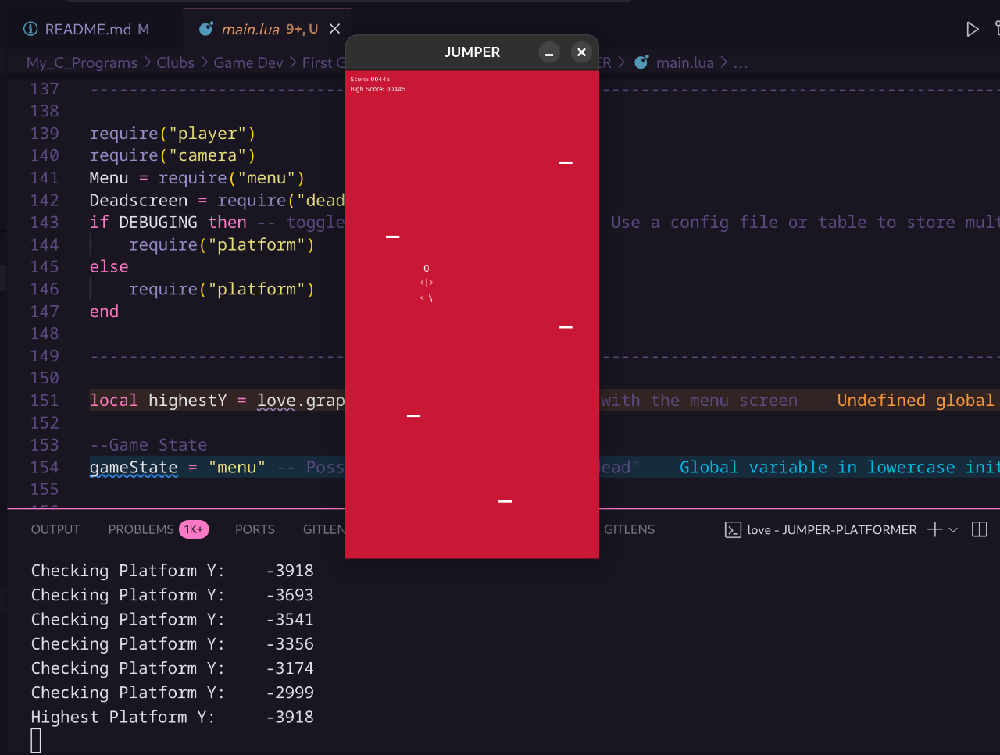

# Jumper-Man
First Game Dev Expirence - Lua Whirlybird inspired - Pixed Art Based Jumper Platformer Game

Made using [Lua Love 2d](https://love2d.org/)

check out my shitty game dev creations at [itchio](https://mry2k.itch.io/)

## Pics:




## How to Play
you can try the game by dropping the .love file on the love2d framwork file on windows 
or install the .AppImage of love2d and run
```bash
love-11.5-x86_64.AppImag Jumper-Man-V0.1.love
```